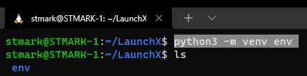
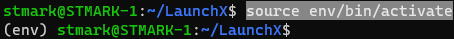
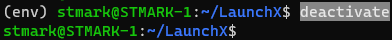
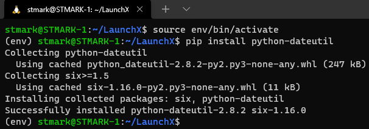

# Crear un entorno virtual

## Creación de entorno virtual en WSL2

* Ejecutar en terminal: ``python3 -m venv env``

  ```
     python3 -m venv env 
  ```



## Activar entorno

* Ejecutar en terminal ``source env/bin/activate``

  ```
     source env/bin/activate 
  ```



## Desactivar entorno

* Ejecutar en terminal ``deactivate``

  ```
     deactivate 
  ```



## Instalar una biblioteca

* Con el entorno activado ejecutamos en la terminal ``pip install python-dateutil``

  ```
     pip install python-dateutil
  ```



* Un mensaje de salida dice que está instalando correctamente, y termina con la siguiente oración:

  ```
  Successfully installed python-dateutil-2.8.2 six-1.16.0
  ```

# Curso Propedútico de Python para Launch X - Innovacción Virtual.

Material desarrollado con base en los contenidos de MSLearn y la metáfora de LaunchX, traducción e implementación por: Fernanda Ochoa - Learning Producer de LaunchX.

Redes:

* GitHub: [FernandaOchoa](https://github.com/FernandaOchoa)
* Twitter: [@imonsh](https://twitter.com/imonsh)
* Instagram: [fherz8a](https://www.instagram.com/fherz8a/)
